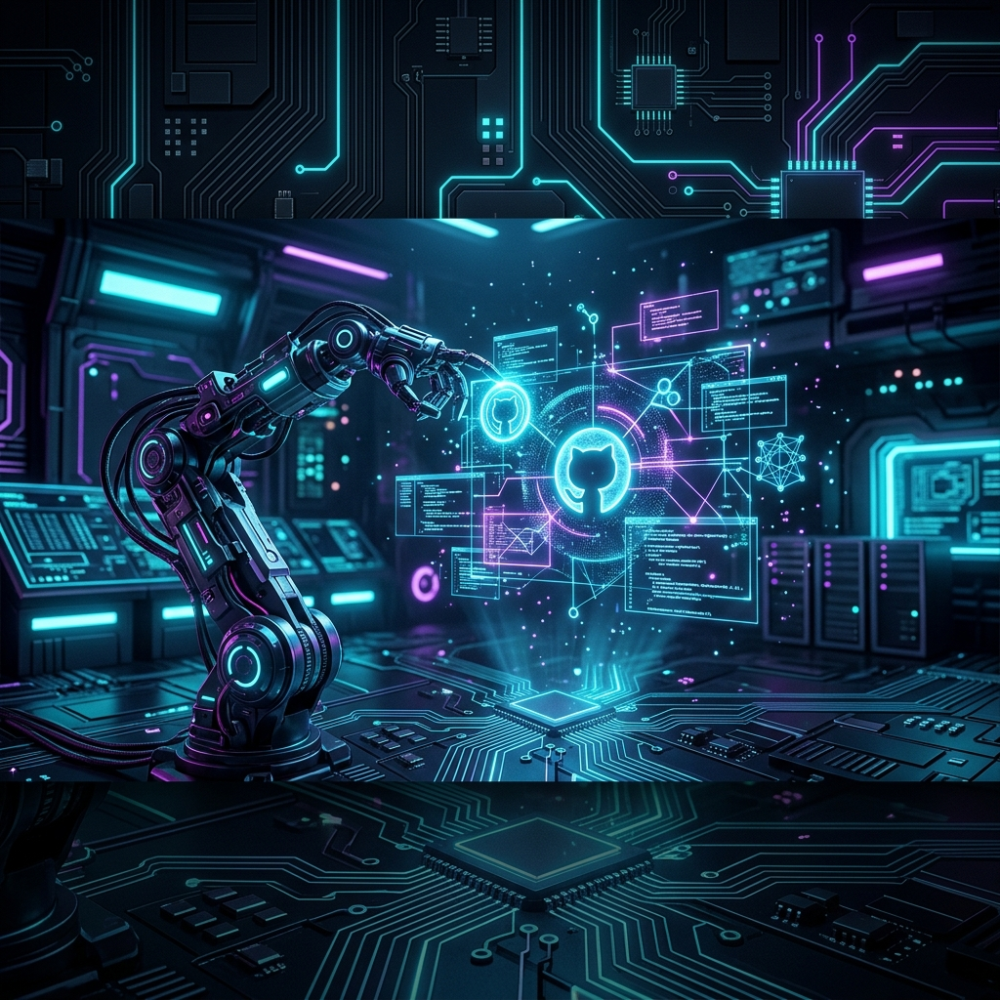

  

<h1 align="center">Hi there, I'm RoboX2020 (Dr. Arora) 👋</h1>
<h3 align="center">Robotics Engineer | Computer Vision & AR Innovator | Hardware Hacker</h3>

  <i>Bridging the physical and digital worlds through robotics, spatial computing, and artificial intelligence.</i>
    

---

### 🚀 About Me

I am a passionate technologist and engineer obsessed with making machines smarter and pixels more interactive. My work spans across **Industrial Robotics**, **Augmented Reality Web Apps**, and **Computer Vision**. 

- 🔭 I’m currently building **autonomous conveyer systems** with Dobot Magician Lite & Opta PLCs.
- 🏗️ Deep diving into **Spatial Audio & AR Hardware Interfaces** (Check out my [Air-Guitar](https://github.com/RoboX2020/Air-Guitar) project!).
- 👁️ Building high-performance real-time **Vision Assist prototypes** using ESP32 and MediaPipe.
- 🌍 Exploring high-fidelity **Three.js WebGL & AR visualizations**.
- 💡 Ask me about integrating Python automation scripts, C++ hardware protocols, or building magical AR hand filters!

---

### 🛠️ Tech Arsenal

  
  **Languages**  
  
  
  
  

  **Robotics & Hardware**  
  
  
  
  
  
  **Computer Vision & AR**  
  
  
  
  
  

---

### 🌟 Featured Projects

<table align="center" width="100%">
  <tr>
    <td width="50%">
      <b>🎸 <a href="https://github.com/RoboX2020/Air-Guitar">Arduino Air-Guitar</a></b> 
      A spatial audio synthesizer that reads wrist-roll and strumming force via an MPU6050 accelerometer to dynamically play chords using the Karplus-Strong string synthesis algorithm.
    </td>
    <td width="50%">
      <b>🤖 Dobot Automation Pipeline</b> 
      A closed-loop industrial automation pipeline integrating an Opta PLC to control a Magician Lite robotic arm and conveyer system relying on C++ and Python multithreading.
    </td>
  </tr>
  <tr>
    <td width="50%">
      <b>✨ AR Hand Magic Filters</b> 
      An immersive WebRTC application employing Google MediaPipe to track complex hand kinematics and cast glowing 3D particle spell effects in real-time.
    </td>
    <td width="50%">
      <b>🌍 Earth AR Visualizer</b> 
      A stunning, interactive high-fidelity 3D Earth globe created with Three.js using custom procedural shaders, specular mapping, and glassmorphic UI elements.
    </td>
  </tr>
</table>

---

### 📊 GitHub Activity

  
  

 

  <i>Stay curious. Keep building. Change the world. 🦾</i>

