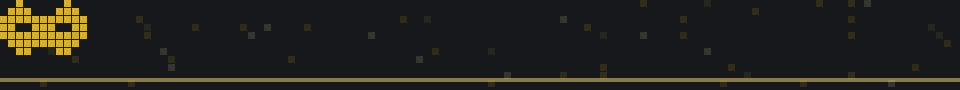
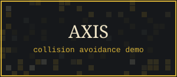
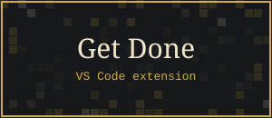
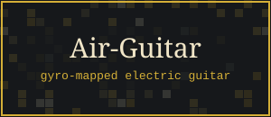
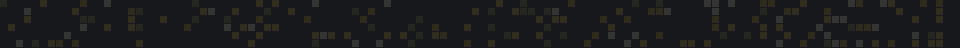
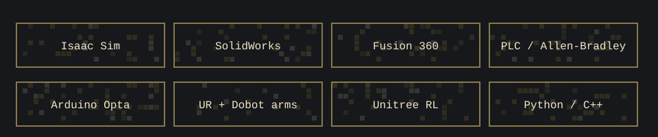
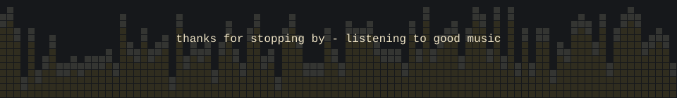

  

## i create things people have never seen before

Would you have imagined a playable electric guitar built from a gyroscope sensor mapping coordinates? Yeah, me neither, until I built it.

<table>
<tr>
<td></td>
<td></td>
<td></td>
</tr>
</table>

More at [prajvalarora.com](https://www.prajvalarora.com).

## toolbox

## numbers

<b>pixel fact</b> (click)

Every pixel in the banner above is a separate SVG square with its own random fade timing. No JavaScript, no GIF, no service. Just ~200 little animations.

